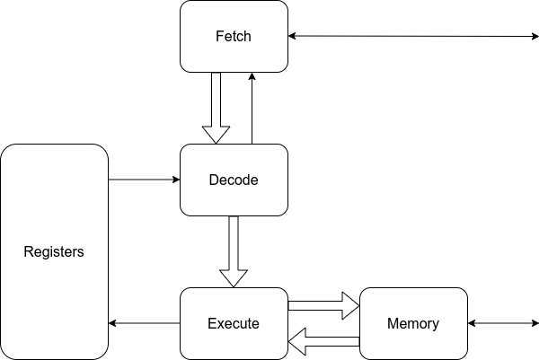

# A new implemenation of the QNICE CPU

## Block diagram


## Synthesis
```
Number of cells:               5633
  BUFG                            1
  CARRY4                         36
  FDRE                          358
  FDSE                            1
  IBUF                            2
  INV                            96
  LUT1                           43
  LUT2                          201
  LUT3                          245
  LUT4                          177
  LUT5                          469
  LUT6                         1379
  MUXF7                         919
  MUXF8                         146
  OBUF                           16
  RAM128X1D                    1024
  RAM32M                          8
  RAM64M                        512

Estimated number of LCs:       2270
```

