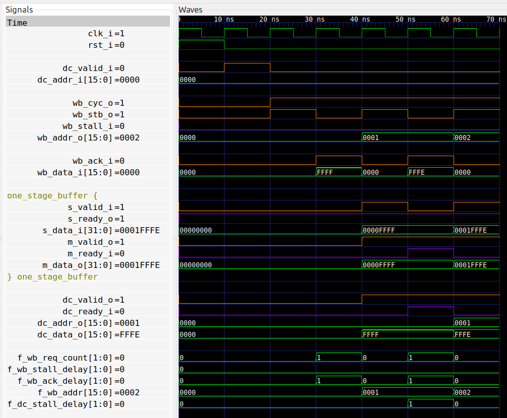

# FETCH module of a yet-to-be-made CPU

Since I plan to write a pipelined CPU and formally verify it, I've chosen to
start with the instruction FETCH module. There is a [very detailed
discussion](http://zipcpu.com/zipcpu/2017/11/18/wb-prefetch.html) about how to
write and formally verify such a module. The only difference is I'm writing the
module itself in VHDL, and the requirements are slightly different. In
particular, this module is expected to have higher throughput, i.e. potentially
able to deliver a new instruction on every clock cycle.

## The interface
The idea is that this module has a WISHBONE Master interface to e.g. a memory and
another interface towards the DECODE stage of the CPU. The DECODE stage accepts
pairs of (address, data) values, where the address increases by 1 every time.
Additionally, the DECODE stage may request a new starting point, e.g.  after a
branch instruction.

Being more specific, the interface of this module can be broken into four
separate interfaces:
* Sending read requests to WISHBONE (with possible back-pressure)
```
      wb_cyc_o   : out std_logic;
      wb_stb_o   : out std_logic;
      wb_stall_i : in  std_logic;
      wb_addr_o  : out std_logic_vector(15 downto 0);
```
* Receiving read responses from WISHBONE
```
      wb_ack_i   : in  std_logic;
      wb_data_i  : in  std_logic_vector(15 downto 0);
```
* Sending instructions to DECODE stage (with possible back-pressure)
```
      dc_valid_o : out std_logic;
      dc_ready_i : in  std_logic;
      dc_addr_o  : out std_logic_vector(15 downto 0);
      dc_data_o  : out std_logic_vector(15 downto 0);
```
* Receiving a new PC from DECODE
```
      dc_valid_i : in  std_logic;
      dc_addr_i  : in  std_logic_vector(15 downto 0);
```

The main point here is that there are two independent data streams into the
FETCH module (data read from WISHBONE and new PC value from the DECODE), and
these two data streams don't support back-pressure. So the FETCH module must at
any time be ready to accept data on these two interfaces, possibly even
simultaneously.

Furthermore, the two outgoing interfaces both support back-pressure. The main
complication here is that we may receive data from the WISHBONE but not be able
to send the data to the DECODE stage. The [simple
version](http://zipcpu.com/zipcpu/2017/11/18/wb-prefetch.html) solved this
problem by not issuing any new WISHBONE request until the DECODE stage had
accepted the current data. This simplifies the design, at the cost of
performance, so I will try to do it better.

## Formal verification
Rather than discussing the implementation, let's dive straight into the formal
verification. The idea is to come up with just the right set of requirements
needed to formally prove the correctness of the implementation.

### Properties of the WISHBONE interface
Let's begin with verifying the WISHBONE transactions. There are some
requirements to the Master (implemented using `assert`) and some requirements
for the Slave (implemented using `assume`).

In order to formulate the `assert` and `assume` statements concisely, it is
convenient to calculate some statistics and timing characteristics of the
interface. The first such are:
* Number of outstanding WISHBONE requests in `p_wb_req_count`. This counts up
  whenever `CYC` and `STB` are high and `STALL` is low, and counts down
  whenever `CYC` and `ACK` are high.

* Number of clock cycles the WISHBONE Slave stalls a request in
  `p_wb_stall_delay`. This counts each clock cycle where `CYC`, `STB`, and
  `STALL` are asserted.

* Number of clock cycles the WISHBONE Slave waits for response in
  `p_wb_ack_delay`. This counts each clock cycle where `CYC` is high and `ACK`
  is low and with at least one outstanding request.

We are now ready to describe the WISHBONE protocol. First we limit the number
of outstanding requests to just 1, i.e. when there is an outstanding request,
don't send a new request. This essentially prevents the Master from pipelining
its requests and limits the bandwidth of this module.
```
f_wb_req_count_max : assert always {f_wb_req_count >= 1} |-> {not wb_stb_o};
```

Then we pose the artifical requirement that the Slave does not stall
indefinitely, and that it responds within a short time. Here I've chosen a
maximum of 2 clock cycles:
```
f_wb_stall_delay_max : assume always {f_wb_stall_delay <= 2};
f_wb_ack_delay_max   : assume always {f_wb_ack_delay <= 2};
```

Then we have the requirement that when `CYC` is low, then `STB` must be low too.
And we also must have that after `CYC` goes low, so must `ACK`. This last
constraint prevents the slave from responding combinatorially.  These
constraints are written as:
```
f_stb_low    : assert always {not wb_cyc_o} |-> {not wb_stb_o};
f_wb_ack_cyc : assume always {not wb_cyc_o} |=> {not wb_ack_i};
```

We want the request signals to be stable while they are stalled:
```
f_wb_stable : assert always {wb_stb_o and wb_stall_i and not dc_valid_i and not rst_i} |=> {stable(wb_stb_o) and stable(wb_addr_o)};
```
Here we allow the Master to abort the current wishbone transaction in case
`dc_valid_i` is asserted.

Finally, we prevent the Slave from asserting `ACK` when there is no outstanding
request:
```
f_wb_ack_pending : assume always {wb_ack_i} |-> {f_wb_req_count > 0};
```

The above were the formal requirements of the WISHBONE protocol itself. However,
we have additional requirements to the actual requests themselves.

Specifically, we want the WISHBONE requests to be consecutive addresses
starting from the value in `dc_addr_i`. So we introduce a new signal
`f_wb_addr` that is to contain the next address expected on the WISHBONE bus.
It will increment any time an `ACK` is received, as follows:
```
p_wb_addr : process (clk_i)
begin
   if rising_edge(clk_i) then
      if wb_cyc_o = '1' and wb_ack_i = '1' then
         f_wb_addr <= f_wb_addr + 1;
      end if;

      if dc_valid_i = '1' then
         f_wb_addr <= dc_addr_i;
      end if;
   end if;
end process p_wb_addr;
```

And the requirement is simply:
```
f_wb_address : assert always {wb_cyc_o and wb_stb_o} |-> wb_addr_o = f_wb_addr;
```

### Properties of the DECODE interface
Here too we begin with some additional statistics:
* Number of clock cycles the DECODE stalls in `f_dc_stall_delay`. This counts
  each clock cycle where `VALID` is high and `READY` is low.
* The last valid address sent to DECODE in `f_dc_last_addr` and
  `f_dc_last_addr_valid`.  The latter signal is cleared whenever `dc_valid_i`
  is high.

We begin by requiring that the output to the DECODE is stable until it is received:
```
f_dc_stable : assert always {dc_valid_o and not dc_ready_i} |=> {stable(dc_valid_o) and stable(dc_addr_o) and stable(dc_data_o)} abort rst_i or dc_valid_i;
```

Next we impose the artificial requirement that the DECODE stage stalls for at most 2 clock cycles:
```
f_dc_stall_delay_max : assume always {f_dc_stall_delay <= 2};
```

Then we have the requirement that the DECODE address is incrementing:
```
f_dc_addr : assert always {dc_valid_o and dc_ready_i; f_dc_last_addr_valid and dc_valid_o} |-> {dc_addr_o = f_dc_last_addr + 1};
```

### Verifying the data path
We want to verify that the data read from the WISHBONE bus is correctly
forwarded to the DECODE interface.  We do this by arbitrarily enforcing that
the data must be the address inverted. This gives a unique relationship that
we can easily test:
```
f_wb_data : assume always {wb_cyc_o and wb_ack_i} |-> wb_data_i = not wb_addr_o;
f_dc_data : assert always {dc_valid_o} |-> dc_data_o = not dc_addr_o;
```

### Additional assumptions about the inputs
We want the module to start with a reset, and the DECODE interface to request
a new address immediately thereafter:
```
f_reset : assume {rst_i};
f_dc_after_reset : assume always {rst_i} |=> dc_valid_i;
```

### Internal Assertions
Finally, since we're instantiating a submodule `one_stage_buffer` we want to validate the inputs
to this buffer. Here we'll just verify that the input is stable until received:

```
f_osb_stable : assert always {osb_in_valid and not osb_in_ready and not rst_i and not dc_valid_i} |=> {stable(osb_in_valid) and stable(osb_in_data)};
```

### Cover statements

As a final step I thought it would be interesting with some specific cover
statements.  The first one is that the DECODE stage accepts data. This is seen
by the `dc_valid_o` signal going from high to low:

```
f_dc_accept : cover {dc_valid_o; not dc_valid_o};
```

The second cover statement is that the DECODE stage can receive two data cycles
back-to-back, i.e. with `dc_valid_o` and `dc_ready_i` asserted for two clock
cycles. After all, this was my initial claim!

```
f_dc_back2back : cover {dc_valid_o and dc_ready_i; dc_valid_o};
```

The last cover statement can be seen in this waveform:


Here we see in the waveform that the WISHBONE interface only delivers data
every other clock cycle. This is not quite what I was hoping for, so there is
still work to do ...

And that is it for the formal verification!

## Implementation details
One difficulty I had when implementing is what happens when we send a WISHBONE
request for the next address, but the DECODE stage has not yet accepted the
current address? This becomes a problem when we receive the response from the
WISHBONE bus, because we have no-where to store the result.

The solution was to make use of the `one_stage_buffer`.

## Synthesis report
I've added a `make` target to use yosys to generate a synthesis report. Just type `make synth`. I get
the following result:

```
   Number of cells:                238
     BUFG                            1
     CARRY4                          4
     FDRE                           84
     IBUF                           38
     INV                             1
     LUT2                            2
     LUT3                           36
     LUT4                            1
     LUT6                           19
     MUXF7                           1
     OBUF                           51

   Estimated number of LCs:         56
```

So an estimated 56 LUTs and 84 registers to implement this FETCH module.

