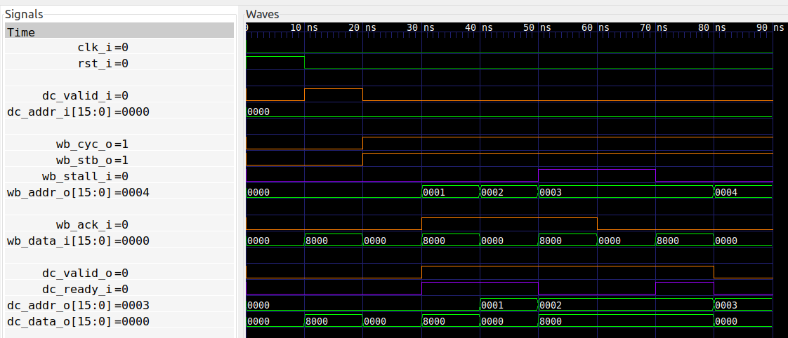

# FETCH module of a yet-to-be-made CPU (optimized version)

The [previous version](../fetch) of the FETCH module was not completely
optimized, and in particular could not sustain a 100% throughput even in best
case.  In this optimized version of the FETCH module I will rewrite the module
from scratch to get better performance.

## Implementation

The strategy this time is much different. From the previous version I was
quickly overwhelmed by complexity, even for such a simple module. So this time
I will use a more hierarchical and general approach.

The idea is to consider the WISHBONE interface as two independent data streams:
A sequence of addresses going out, and a corresponding sequence of data coming
in.  And pairs of (address,data) is to be sent to the DECODE stage.

Therefore I instantiate two FIFOs. The first FIFO is filled with the stream
of addresses sent to the WISHBONE interface, and the second FIFO is filled with
the streams of data received from the WISHBONE interface. Finally, the outputs
of these two FIFOs are concatenated and sent to the DECODE stage.

In this particular version I expect the WISHBONE data to arrive on the next
clock cycle, i.e. a latency of just one clock cycle. Therefore, at most two
requests need to be stored in the address FIFO, and we can therefore use the
pre-existing [two_stage_fifo](../two_stage_fifo).

The data FIFO must also be able to store two words, and to reduce latency we
can conveniently use a [two_stage_buffer](../two_stage_buffer). So the bulk of
the implementation is shown in the skeleton code below:

```
i_two_stage_fifo_addr : entity work.two_stage_fifo
   port map (
      s_valid_i => wb_cyc_o and wb_stb_o and not wb_stall_i,
      s_ready_o => tsf_in_addr_ready,
      s_data_i  => wb_addr_o,
      m_data_o  => tsf_out_addr_data
      etc...

i_two_stage_buffer_data : entity work.two_stage_buffer
   port map (
      s_valid_i => wb_cyc_o and wb_ack_i,
      s_ready_o => tsb_in_data_ready,
      s_data_i  => wb_data_i,
      m_data_o  => tsb_out_data_data
      etc...

i_pipe_concat : entity work.pipe_concat
   port map (
      s1_data_i              => tsf_out_addr_data,
      s0_data_i              => tsb_out_data_data,
      m_valid_o              => dc_valid_o,
      m_ready_i              => dc_ready_i,
      m_data_o(31 downto 16) => dc_addr_o,
      m_data_o(15 downto 0)  => dc_data_o
      etc...
```

With this approach I'm guaranteed that the address and data signals will always
be in sync.  The only remaining code is controlling the WISHBONE requests, and
it's all done in a single process:

As usual, the first thing is to clear the WISHBONE request whenever it has been
accepted:
```
if not wb_stall_i then
   wb_stb_o <= '0';
end if;
```

We want the wishbone address to increment for each request. The time to
increment it is right after the request has been accepted:
```
if wb_cyc_o and wb_stb_o and not wb_stall_i then
   wb_addr_o <= wb_addr_o + 1;
end if;
```

If there are no active requests, we should release the bus.  The lines below
will release the bus one clock later. So there is a potential optimizatin here,
since the bus could be released on the **same** clock cycle as
`tsf_in_addr_fill` being zero, i.e one clock cycle earlier than what we're
doing below.
```
if tsf_in_addr_fill = "00" then
   wb_cyc_o <= '0';
end if;
```

When a new address is received from the DECODE stage we should store it, and abort
any current wishbone transactions.
```
if dc_valid_i = '1' then
   wb_addr_o <= dc_addr_i;
   wb_cyc_o <= '0';
   wb_stb_o <= '0';
end if;
```

The tricky part is when to start a new transaction. We have to make sure that
when the address is requested (on the next clock cycle) we have room in the
address FIFO. Furthermore we must make sure that there is room in the data FIFO
for the wishbone result. And finally, if a new address is received from the
DECODE stage, we should abort the current transaction first, i.e. let the
CYC line drop low for a clock cycle before going high again. All this is
encoded as follows:
```
if (tsf_out_addr_ready or nor(tsf_in_addr_fill)) and tsb_in_data_ready and not (wb_cyc_o and dc_valid_i) then
   wb_cyc_o <= '1';
   wb_stb_o <= '1';
end if;
```

Finally, we clear everything upon reset.
```
if rst_i = '1' then
   wb_cyc_o <= '0';
   wb_stb_o <= '0';
end if;
```

## Formal verification
In the implementation above notice that the data received from the WISHBONE
interface has no back-pressure. Therefore, we must ASSERT that the
`two_stage_buffer` always will accept the incoming data. This is handled by the
following assertion.

```
f_data_ready : assert always {wb_cyc_o and wb_ack_i} |-> {tsb_in_data_ready};
```

The same property must hold for the address entering the address fifo since
that too has no back pressure. So we have the corresponding ASSERT on the
address fifo input:

```
f_addr_ready : assert always {wb_cyc_o and wb_stb_o and not wb_stall_i} |-> {tsf_in_addr_ready};
```

Note that these two assertions make use of the internal signals
`tsb_in_data_ready` and `tsf_in_addr_ready`.

## Running formal verification


## Synthesis
```
Number of cells:                271
  BUFG                            1
  CARRY4                          4
  FDRE                           85
  FDSE                            1
  IBUF                           38
  INV                             1
  LUT2                           11
  LUT3                           55
  LUT4                           21
  LUT5                            1
  LUT6                            2
  OBUF                           51

Estimated number of LCs:         79
```

