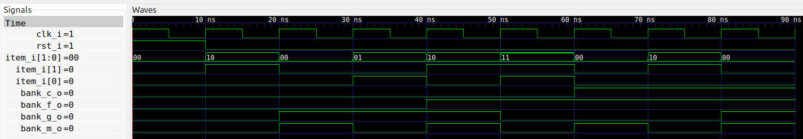

# Fox, Goat, and Cabbage
This is a small example idea I copied from [this
video](https://www.youtube.com/watch?v=H3tsP9tjYdY).

To run this example just type

```
make
```

To show the solution, type

```
make show
```




To clean up, type

```
make clean
```

