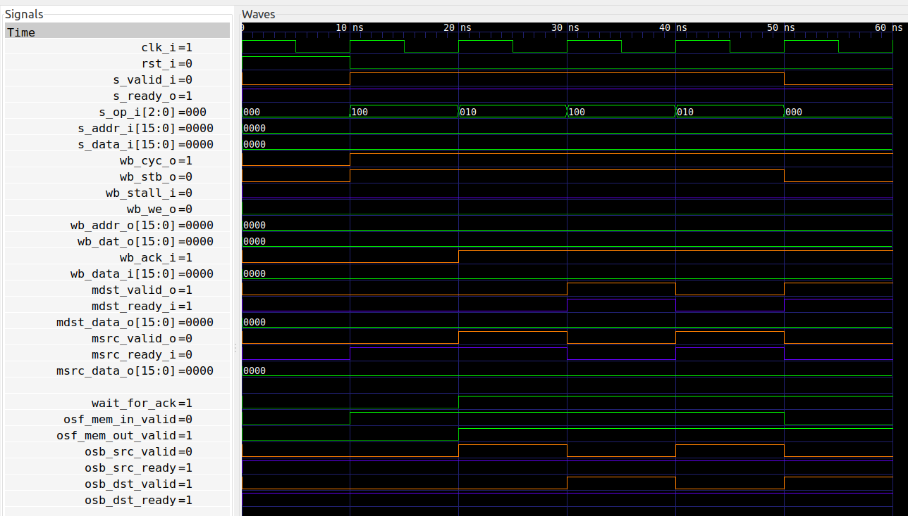

# MEMORY module of a yet-to-be-made CPU (optimized version)

When designing and connecting the different blocks that make up the CPU I find
it convenient to make use of "elastic pipelines", i.e. where the interface
consists of a `valid` signal from source to sink, and a `ready` signal from the
sink back to the source. However, the WISHBONE protocol is not as easy, because
the WISHBONE response signal `wb_ack_i` can not be delayed.

Therefore, I find it convenient to introduce the MEMORY module, which acts as
an "adapter" from the WISHBONE interface to the "elastic pipeline" interface.
Furthermore, the MEMORY module stores the responses on two different output
pipelines, for use by the CPU.

## Interface

The MEMORY module exposes a source interface (connected to the EXECUTE module)
as follows:
```
s_valid_i    : in  std_logic;
s_ready_o    : out std_logic;
s_op_i       : in  std_logic_vector(2 downto 0);
s_addr_i     : in  std_logic_vector(15 downto 0);
s_data_i     : in  std_logic_vector(15 downto 0);
```

The `s_op_i` is a one-hot encoding of the requested operation:
* `C_WRITE` : Write `data` to `addr`.
* `C_READ_DST` : Read from `addr` and place result in `src`.
* `C_READ_SRC` : Read from `addr` and place result in `dst`.

The `src` and `dst` interfaces mentioned here are the two output pipelines:
```
msrc_valid_o : out std_logic;
msrc_ready_i : in  std_logic;
msrc_data_o  : out std_logic_vector(15 downto 0);

mdst_valid_o : out std_logic;
mdst_ready_i : in  std_logic;
mdst_data_o  : out std_logic_vector(15 downto 0);
```

The idea is that the EXECUTE block issues requests and reads back the results
at a later time.

The main benefit of this module is that it **stores** the results read back from
memory, in case the EXECUTE module is not yet ready to receive them.

## Implementation
We want the module to have low latency - ideally a total latency of one clock
cycle - from `s_valid_i` to, say, `msrc_valid_o`. In fact, this is achieved in
this implementation. We'll discuss the data path and the control path
separately.

### Data Path

So first of all, the WISHBONE request interface is driven combinatorially, i.e.
the address and data signals are simply connected directly:
```
wb_addr_o <= s_addr_i;
wb_we_o   <= s_op_i(C_WRITE);
wb_dat_o  <= s_data_i;
```

Secondly, the WISHBONE response `wb_data_i` is connected to two different
instancies of `one_stage_buffer`.

```
i_one_stage_buffer_src : entity work.one_stage_buffer
   port map (
      clk_i     => clk_i,
      rst_i     => rst_i,
      s_valid_i => osb_src_valid,
      s_ready_o => osb_src_ready,
      s_data_i  => wb_data_i,
      m_valid_o => msrc_valid_o,
      m_ready_i => msrc_ready_i,
      m_data_o  => msrc_data_o
   ); -- i_one_stage_buffer_src

i_one_stage_buffer_dst : entity work.one_stage_buffer
   port map (
      clk_i     => clk_i,
      rst_i     => rst_i,
      s_valid_i => osb_dst_valid,
      s_ready_o => osb_dst_ready,
      s_data_i  => wb_data_i,
      m_valid_o => mdst_valid_o,
      m_ready_i => mdst_ready_i,
      m_data_o  => mdst_data_o
   ); -- i_one_stage_buffer_dst
```

Notice how the `wb_data_i` signal connects directly to both buffers, and that
the output from these buffers are directly connected to the outputs of this
module.

We have to be careful though: When the WISHBONE response arrives we must make
sure that the output buffers can accept the data, because the response exists
only for a single clock cycle. We'll get back to this in the section about
formal verification.

### Control Path
The control path is responsible for the WISHBONE request control signals,
controlling the two output buffers, and the upstream ready signal.

Let's review the WISHBONE interface.  When a request is made, the `wb_cyc_o`
must be held high until the acknowledge is received. So we need a flag to
indicate whether we're waiting for an acknowledge. This is all achieved by the
following:

```
wb_cyc_o  <= ((s_valid_i and s_ready_o) or wait_for_ack) and not rst_i;
wb_stb_o  <= wb_cyc_o and s_valid_i and s_ready_o;

p_wait_for_ack : process (clk_i)
begin
   if rising_edge(clk_i) then
      if wb_cyc_o and wb_ack_i then
         wait_for_ack <= '0';
      end if;

      if wb_cyc_o and wb_stb_o and not wb_stall_i then
         wait_for_ack <= '1';
      end if;

      if rst_i = '1' then
         wait_for_ack <= '0';
      end if;
   end if;
end process p_wait_for_ack;
```

Both read and write requests are always followed by a corresponding acknowledge
signal. It's not possible to perform read and write simultaneously.  However,
when an acknowledge signal arrives there is no indication of which request it
originated from.  This means we must keep track of the requests sent, in
particular the read requests.

Therefore we instantiate a `one_stage_fifo` as well, to keep track of this
information. This fifo only keeps track of read requests and only contains a
single bit to distinguish whether the result should be stored in the SRC or DST
pipeline.

```
osf_mem_in_valid <= s_valid_i and s_ready_o and (s_op_i(C_READ_SRC) or s_op_i(C_READ_DST));

i_one_stage_fifo_mem : entity work.one_stage_fifo
   generic map (
      G_DATA_SIZE => 1
   )
   port map (
      clk_i       => clk_i,
      rst_i       => rst_i,
      s_valid_i   => osf_mem_in_valid,
      s_ready_o   => osf_mem_in_ready,
      s_data_i(0) => s_op_i(C_READ_SRC),
      m_valid_o   => osf_mem_out_valid,
      m_ready_i   => wb_cyc_o and wb_ack_i,
      m_data_o(0) => osf_mem_out_data
   ); -- i_one_stage_fifo_mem
```

The above shows that whenever a read request is accepted, the request is
stored in the fifo.  Furthermore, when an acknowledge is received from the
WISHBONE, then we read out the request information from the fifo.

Using this information we can now control writing into the two output buffers:

```
osb_src_valid <= wb_cyc_o and wb_ack_i and osf_mem_out_valid and osf_mem_out_data;
osb_dst_valid <= wb_cyc_o and wb_ack_i and osf_mem_out_valid and not osf_mem_out_data;
```

The final part is to control the `s_ready_o` upstream signal. The main
limitation is that each output buffer can hold only one value. So if the
request is a read to SRC, and the output SRC buffer contains data that it can't
deliver, then we must wait. Similarly for DST.

This leads to the following logic:
```
s_ready_o <= not (s_op_i(C_READ_SRC) and msrc_valid_o and not msrc_ready_i)
         and not (s_op_i(C_READ_DST) and mdst_valid_o and not mdst_ready_i);
```

Notice how the upstream ready signal depends on the contents of the downstream
`s_op_i` signal.  This is non-standard, but allows the module to accept a read
DST even though the SRC output is still waiting.

## Formal verification

### Internal assertions
We mentioned above that a requirement for this design to work is that the
output buffers are always ready to accept a response from the WISHBONE.
Therefore, we being with the following two properties:

```
f_osb_src_overflow : assert always {osb_src_in_valid and not rst_i} |-> {osb_src_in_ready};
f_osb_dst_overflow : assert always {osb_dst_in_valid and not rst_i} |-> {osb_dst_in_ready};
```

### Assumptions about inputs

First of all we must ensure the correct format of the input operation:
```
f_exe_op : assume always {s_valid_i} |-> {s_op_i = "001" or s_op_i = "010" or s_op_i = "100"};
```

### Cover statements
To demonstrate the correct functionality of the module, let's add a cover
statement. This will verify that the module can output four values
back-to-back, alternating on the SRC and DST interfaces. Additinally, we
restrict the ready signals correspondingly:
```
f_cover_burst2 : cover {msrc_valid_o and msrc_ready_i and not mdst_ready_i;
                        mdst_valid_o and mdst_ready_i and not msrc_ready_i;
                        msrc_valid_o and msrc_ready_i and not mdst_ready_i;
                        mdst_valid_o and mdst_ready_i and not msrc_ready_i};
```

## Running formal verification


## Synthesis
```
Number of cells:                217
  BUFG                            1
  FDRE                           37
  IBUF                           58
  LUT2                            4
  LUT3                           40
  LUT4                            1
  LUT5                            1
  LUT6                            4
  MUXF7                           1
  OBUF                           70

Estimated number of LCs:         46
```

