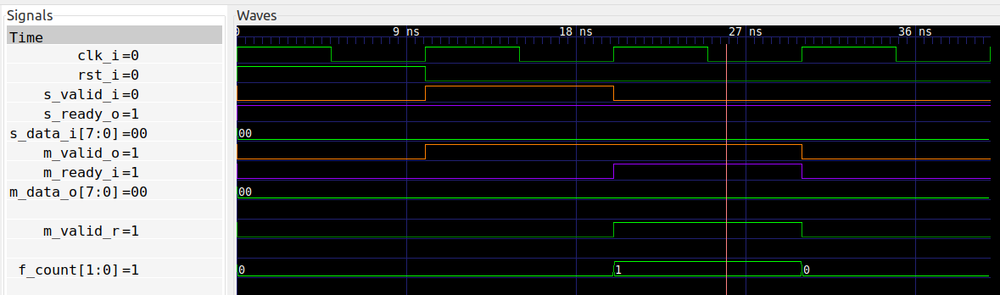

# Another simple module : One Stage Buffer
This module is very similar to the [one_stage_fifo](../one_stage_fifo) we just
completed.  In particular, the port signals are the same as for
`one_stage_fifo`, but the functionality is slightly different.

The requirements here are that this buffer works as a combinatorial wire
between the sender and the receiver.
In other words, where the FIFO would have
a latency of one clock cycle from input to output, then this BUFFER has zero
latency: Valid input data is available on the output signals in the same clock
cycle.

Howeve, if the receiver is not ready, then this module will store the data for
later.  This module is useful e.g. in situations where the sender does not
support back-pressure.

The differences between the two modules are very small and subtle, and I've
tried to keep the implementations as close as possible.

## Running formal verification

Once again, to run the formal verification, just type `make`.  The result of
the cover statement is seen below:


## Synthesis

And the result of synthesis is shown here:
```
Number of wires:                 34
Number of wire bits:             74
Number of public wires:          11
Number of public wire bits:      32
Number of memories:               0
Number of memory bits:            0
Number of processes:              0
Number of cells:                 44
  BUFG                            1
  FDRE                            9
  IBUF                           12
  LUT2                            1
  LUT3                           11
  OBUF                           10

Estimated number of LCs:         11
```

