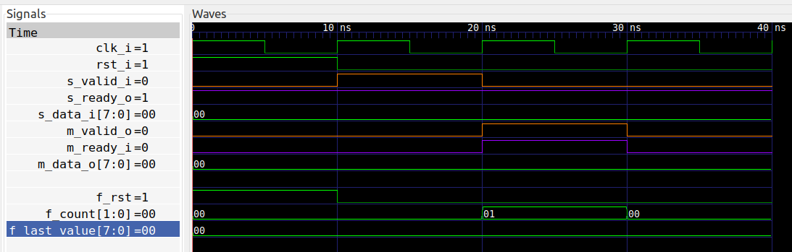

# Hello World : One Stage Fifo
For my first attempt at formal verification, I've decided to work on a
one-stage FIFO.  This is basically a register with a write-enable, but with the
added ability to provide back-pressure. So the implementation contains a small
FSM revolving around whether or not the FIFO contains valid data.

## The protocol (how the FIFO works)
There is a producer (or source) that feeds data into the FIFO, and there is
a consumer (or sink) that reads data out of the FIFO.

Both the producer and the consumer interfaces are identical, with a DATA and
VALID signal going downstream, and a READY signal going upstream. When both
VALID and READY are asserted simultaneously on a given interface (either
producer or consumer) then the DATA is moved (either into or out of the
register).  This is a simplified version of the protocol used in [AXI streaming
interfaces](https://zipcpu.com/doc/axi-stream.pdf). It is possible to
simultaneously (i.e. in the same clock cycle) move data into the FIFO and out
of the FIFO, regardless of whether the FIFO is empty or full.

Although not strictly necessary for the correct operation of this protocol,
I've added two additional constraints: When the upstream has asserted VALID, and
READY is not yet asserted, the signals DATA and VALID are required to remain
unchanged, until the data transfer has completed.  In other words, the sender
may not "change its mind" once it has announced that data is waiting.  This
requirement is not strictly necessary, but is kind of "common sense". However,
it does mean the sender is not able to "abort" a transfer.

The second requirement is that once a consumer asserts ready, then the ready
signal must remain asserted until new data is received. The idea is that the
only reason a consumer will become not ready is by receiving new data.

One thing to note about this protocol is that the upstream READY signal (back
towards the producer) is often combinatorial, whereas the downstrean VALID and
DATA signals are registered. This combinatorial path on the READY signal may
(or may not) give timing problems. This is just something to be aware of. This
combinatorial path can be registered for improved timing, but requires a
two-stage FIFO. More on that later.

## The implementation
The FIFO implementation is found [here](one_stage_fifo.vhd). The implementation
is quite simple and I'll just go over it very quickly. It consists of a single
process controlling the registered outputs `m_valid_r` and `m_data_r`.

The first part of the process handles acknowledgement from the consumer:
```
if m_ready_i = '1' then
   m_valid_r <= '0';
end if;
```
This statement prevents any data from lingering on the output signals after it
has been received by the consumer.  Note: It is important to place this logic
in the beginning of the process, so later statements may override. 

Next we handle the case of incoming data:
```
if s_ready_o = '1' and s_valid_i = '1' then
   m_data_r  <= s_data_i;
   m_valid_r <= '1';
end if;
```
The key point here is that when both VALID and READY are asserted, then the
input data must be taken care of in that clock cycle.

Finally, we handle reset:
```
if rst_i = '1' then
   m_valid_r <= '0';
end if;
```
There is no need to reset the `m_data_r` signal.

## Formal verification
Instead of writing a testbench that manually generates stimuli, we envision the
FIFO requirements as a "contract", and we aim to describe this contract
programmatically. Specifically, we will be using the language
[PSL](http://www.project-veripage.com/psl_tutorial_1.php) (Property
Specification Language). The formal verification tool ([SymbiYosys and GHDL](../INSTALL.md))
will then exhaustively search for sequences of inputs that lead to violations
of this contract. If the tool is successful, it will generate a testbench and
waveform showing the exact failure.

To be more concrete we will be formulate the requirements of the contract using
[PSL assertions](http://www.project-veripage.com/psl_tutorial_1.php), placed in
a separate [PSL file](one_stage_fifo.psl).  The assertions in PSL are more
powerful (i.e. allow more complex constructions) than regular VHDL assertions.
The process of writing these `assert` commands is non-trivial, and takes some
practice. I will describe in detail how this is done for this one-stage FIFO.

The main keywords to use are `assume` (for constraining input), `assert` (for
validating output), and `cover` (for ensuring reachability).

One general thing about formal verification is that it is synchronous, and
therefore requires specifying a clock. Since most entities use only a single
clock, this can be selected efficiently by this single line:

```
default clock is rising_edge(clk_i);
```

### Assertions on outputs
We're now ready to start expressing the properties of the FIFO as assertions on
the outputs.

The first simple requirement is that after a reset the FIFO must be empty. This
is described by this command:

```
f_after_reset : assert always {rst_i} |=> not m_valid_o;
```

The word `f_after_reset` is just a label. I like to use the naming convention
of having every label and signal related to formal verification begin with
`f_`.

The symbol `|=>` means "assert on the next clock cycle". So if `rst_i` is
asserted at some time, then on the very next clock cycle `m_valid_o` must be
false.

Next we assert the property that any valid output remains stable until read.
```
f_output_stable : assert always {m_valid_o and not m_ready_i and not rst_i} |=> {stable(m_valid_o) and stable(m_data_o)};
```
Here the combination `m_valid_o and not m_ready_i` indicates the FIFO outputs
data, but the data is not read yet. Then on the next clock cycle, the outputs
from the FIFO should be unchanged.

Similarly, we assert that the upstream ready signal must be stable until we
receive new data.
```
f_ready_stable : assert always {s_ready_o and not s_valid_i and not rst_i} |=> {stable(s_ready_o)};
```

The next few properties rely on keeping track of the amont of data flowing into
and out of the FIFO. So we introduce a new signal `f_count` that contains the
current number of items in the FIFO, based on the input and output signals only.

This is done using the following simple code:
```
p_count : process (clk_i)
begin
   if rising_edge(clk_i) then
      -- Data flowing in, but not out.
      if s_valid_i and s_ready_o and not (m_valid_o and m_ready_i) then
         f_count <= f_count + 1;
      end if;

      -- Data flowing out, but not in.
      if m_valid_o and m_ready_i and not (s_valid_i and s_ready_o) then
         f_count <= f_count - 1;
      end if;

      if rst_i then
         f_count <= 0;
      end if;
   end if;
end process p_count;
```

Additionally, we want to keep track of the last data written into
the FIFO, below written into yet another signal `f_last_value`:
```
p_last_value : process (clk_i)
begin
   if rising_edge(clk_i) then
      -- Remember last value written into FIFO
      if s_valid_i and s_ready_o then
         f_last_value <= s_data_i;
      end if;
   end if;
end process p_last_value;
```

We can now formulate our FIFO properties in terms of this count.

First of all, the size is constrained to the interval `[0, 1]`:
```
f_size : assert always {0 <= f_count and f_count <= 1};
```

If the FIFO is full, then it must present valid data on the output
```
f_count_1 : assert always {f_count = 1} |-> {m_valid_o = '1' and m_data_o = f_last_value} abort rst_i;
```

Similarly, if the FIFO is empty, then no valid data must be output
```
f_count_0 : assert always {f_count = 0} |-> {m_valid_o = '0'} abort rst_i;
```
Note the use of `abort rst_i` in the last two assertions. This syntax creates
an exception to the assertion, instructing the tool to ignore the assertion in
case of reset.

### Assumptions about inputs
Sometimes we have to impose restrictions on the inputs.  We use the `assume`
keyword to restrict the allowed inputs.

For instance, one such requirement is that we start of in a reset condition.
This can be written as follows:
```
f_reset : assume {rst_i};
```

Note the absence of the keyword `always`. So this assumption only applies in the first clock cycle,
which is exactly what we want.

### Cover statements to verify reachability

Finally, the `cover` statement is used to automatically generate stimuli.

For this simple FIFO I've chosen to detect the situation where the FIFO
transitions from full to empty.

```
f_full_to_empty : cover {m_valid_o and not rst_i; not m_valid_o};
```

Note here the use of `;` inside the `{}`. The symbol `;` indicates the passage
of one clock cycle. So the expression `{m_valid_o and not rst_i; not
m_valid_o}` states that on one clock cycle the FIFO should be full and with no
reset, and then on the **next** clock cycle the FIFO should be empty. So this
is a two-clock-cycle sequence of signals.

By writing `cover` statements the formal verification tool will automatically
try to generate the stimuli necessary to satisfy the condition. In other words,
the tool writes the testbench for you!

## Running the formal verifier
In order to run the formal verifier, we must create a small
script [one_stage_fifo.sby](one_stage_fifo.sby).

The tricky line in the script is the following:
```
ghdl --std=08 one_stage_fifo.vhd one_stage_fifo.psl -e one_stage_fifo
```
The command line option `--std=08` is necessary to enable the PSL feature.

Then we just run the verifier using the command
```
sby --yosys "yosys -m ghdl" -f one_stage_fifo.sby
```

This command is conveniently stored in a Makefile to allow the simple command
to run verification:

```
make
```

This generates a lot of output. Among the plethora of text you should see the
lines

```
...
[one_stage_fifo_bmc] DONE (PASS, rc=0)
...
[one_stage_fifo_cover] DONE (PASS, rc=0)
...
[one_stage_fifo_prove] DONE (PASS, rc=0)
...
```

To see the result of the `cover` statemet, just type
```
make show_cover
```
This will bring up the waveform showing the successful completion of the cover statement.

The diagram shows how data enters the FIFO and then leaves the FIFO again.

This is it! We've now formally verified that the implementation of the one
stage fifo satisfies all the formal requirements.

Here it is a good idea to step back and review what we have done. We've
transcribed the FIFO requirements into PSL statements and verified these
statements are satisfied by the implementation. Does the FIFO now work?  Well,
there may still be bugs in the implementation. This could happen, if the PSL
statements are not strict enough. I.e. if there are requirements that are not
properly expressed in PSL statements.

## Synthesis

Moving on, I've added another target in the Makefile to use Yosys as a synthesis tool.
Just type
```
make synth
```

The end of the generated log file `yosys.log` contains a summary of the synthesis:
```
Number of wires:                 18
Number of wire bits:             48
Number of public wires:          11
Number of public wire bits:      32
Number of memories:               0
Number of memory bits:            0
Number of processes:              0
Number of cells:                 35
  BUFG                            1
  FDRE                            9
  IBUF                           12
  LUT2                            1
  LUT3                            2
  OBUF                           10

Estimated number of LCs:          2
```

