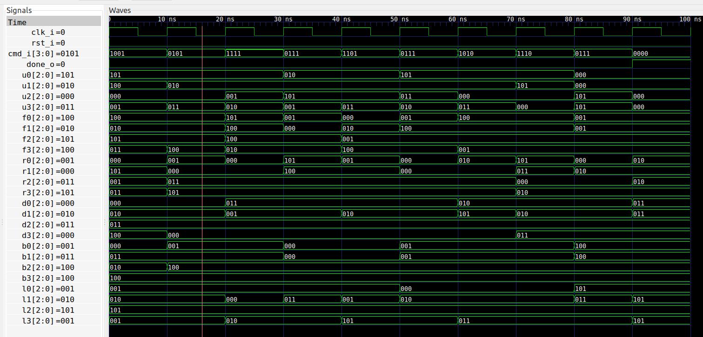

# Rubik's 2x2x2 cube solver

This is another fun application of the formal verification tools;
used here to solve the Rubik's 2x2x2 cube.

## Implementation
The cube has six faces each with four colors, i.e.  a total of 24 tiles.  Each
color is selected from a palette of six possible colors.  So I've chosen a
simple representation, where I assign each of the 24 tiles a 3-bit value for
the color.

The faces are called `U` (Up), `F` (Front), `R` (Right), `D` (Down), `B`
(Back), and `L` (Left), and the state of the cube is represented by
these signals:

```
signal u0 : std_logic_vector(2 downto 0);
signal u1 : std_logic_vector(2 downto 0);
signal u2 : std_logic_vector(2 downto 0);
signal u3 : std_logic_vector(2 downto 0);

signal f0 : std_logic_vector(2 downto 0);
signal f1 : std_logic_vector(2 downto 0);
signal f2 : std_logic_vector(2 downto 0);
signal f3 : std_logic_vector(2 downto 0);

etc.
```

The tiles are numbered as follows:
```
        U0 U1
        U2 U3
        -----
L0 L1 | F0 F1 | R0 R1 | B0 B1
L2 L3 | F2 F3 | R2 R3 | B2 B3
        -----
        D0 D1
        D2 D3
```

I've chosen to keep the action on the cube simple. Since the cube is only
2x2x2, I can limit the possible rotations to only the `U`, `F`, and `R` sides.
So a total of nine possible commands:

* `C_CMD_FP = F+`
* `C_CMD_F2 = F2`
* `C_CMD_FM = F-`
* `C_CMD_RP = R+`
* `C_CMD_R2 = R2`
* `C_CMD_RM = R-`
* `C_CMD_UP = U+`
* `C_CMD_U2 = U2`
* `C_CMD_UM = U-`

The interface to [the module](rubik.vhd) is very simple:

```
cmd_i  : in  std_logic_vector(3 downto 0);
done_o : out std_logic
```

The combinatorial signal `done_o` is asserted when the cube is solved.

## Simulation (manual testbench)
For the sake of generating a suitable problem for the solver, I've implemented
a [regular testbench](rubik_tb.vhd).

This testbench has two purposes. First it verifies the period of each of the
nine possible rotations. So for instance, the rotation `F+` has a period of 4.
This means that repeating the rotation four times should leave cube unchanged.
This is a manual test (i.e not using formal verification) to clear out some of
the typing mistakes in the implementation.

The second part of the testbench generates a sequence of random commands,
starting from the solved cube. I then manually record the outcome and use it
as initial condition in the [implementation file](rubik.vhd).

To run the simulation just type
```
make sim
```

## Formal verification
I'm using formal verification here to try to solve the cube. So from the
testbench I have created a random (but legal!) coloring of the cube, and use
that as initial condition when declaring the signals `u0`, `u1`, etc.

I've added a few assertions to verify the correct functionality of the
implementation.  Specifically, I require all eight corner pieces to have three
unique colors. For the first corner it looks like:
```
f_edge_u2_f0 : assert always {u2 /= f0};
f_edge_u2_l1 : assert always {u2 /= l1};
f_edge_l1_f0 : assert always {l1 /= f0};
```
Similar lines are repeated for the remaining corners.

Secondly, I require that all the tiles should have equal number of colors. I.e.
the 24 tiles should have four tiles of each of the six colors. This is done
by creating a new signal `f_num_colors` that contains the number of tiles of
each color. Then I simply add the following statement:
```
f_colors : assert always {f_num_colors(0 to 5) = (0 to 5 => 4)};
```

The above were just some extra checks to catch any additional bugs in the
implementation.  For solving the cube I simply add the line:
```
f_done : cover {done_o};
```

However, the solver will try to cheat(!) by asserting the reset signal, so this
must be prevented by:
```
f_no_rst : assume always {not rst_i};
```

Now I can simply run
```
make
```

The solution takes around a minute to find, and can then be viewed by writing
```
make show_cover
```


This shows that the cube (from this particular initial condition) can be solved
in a sequence of nine rotations.

## Synthesis
Finally, just for fun, we can synthesize the module by typing
```
make synth
```
The result can be seen below

```
   Number of wires:                157
   Number of wire bits:            313
   Number of public wires:          28
   Number of public wire bits:      79
   Number of memories:               0
   Number of memory bits:            0
   Number of processes:              0
   Number of cells:                272
     BUFG                            1
     FDRE                           40
     FDSE                           23
     IBUF                            6
     LUT2                            1
     LUT3                           13
     LUT5                           75
     LUT6                           69
     MUXF7                          35
     MUXF8                           8
     OBUF                            1

   Estimated number of LCs:        157
```

The interesting thing is that if we add the numbers for `FDRE` and `FDSE` we
get a total of 63 registers. Surely, the cube contains 24 tiles with 3 bits for
each tile, so a total of 72 registers are needed?

Not so fast! Since we only consider rotations of three of the faces, one of the
corners (`D2,B3,L2`) is completely untouched, and its three tiles never change
color. So that reduces the number of registers by 9.

