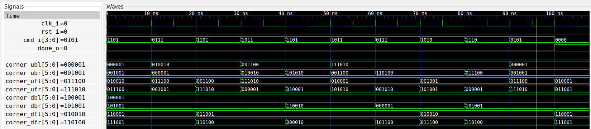

# Rubik's 2x2x2 cube solver

This is a second version of the Rubik's 2x2x2 cube solver.

## Implementation
This time I'm trying to simplify the implementation and instead of considering
individual tiles (24 in total), I consider the position and orientation of each
corner (8 in total).

I've chosen to keep the action on the cube simple. Since the cube is only
2x2x2, I can limit the possible rotations to only the `U`, `F`, and `R` sides.
So a total of nine possible commands:

* `C_CMD_FP = F+`
* `C_CMD_F2 = F2`
* `C_CMD_FM = F-`
* `C_CMD_RP = R+`
* `C_CMD_R2 = R2`
* `C_CMD_RM = R-`
* `C_CMD_UP = U+`
* `C_CMD_U2 = U2`
* `C_CMD_UM = U-`

The interface to [the module](rubik.vhd) is very simple:

```
cmd_i  : in  std_logic_vector(3 downto 0);
done_o : out std_logic
```

The combinatorial signal `done_o` is asserted when the cube is solved.

## Simulation (manual testbench)
For the sake of generating a suitable problem for the solver, I've implemented
a [regular testbench](rubik_tb.vhd).

This testbench has two purposes. First it verifies the period of each of the
nine possible rotations. So for instance, the rotation `F+` has a period of 4.
This means that repeating the rotation four times should leave cube unchanged.
This is a manual test (i.e not using formal verification) to clear out some of
the typing mistakes in the implementation.

The second part of the testbench generates a sequence of random commands,
starting from the solved cube. I then manually record the outcome and use it
as initial condition in the [implementation file](rubik.vhd).

To run the simulation just type
```
make sim
```

## Formal verification
I'm using formal verification here to try to solve the cube. So from the
testbench I have created a random (but legal!) coloring of the cube, and use
that as initial condition when declaring the signals `corner_ubl`, etc.

I've added an assertion to verify that the position is indeed legal and can be
solved. This is done by calculating the parity (an invariant) of the position
and asserting it is always zero:

```
f_colors : assert always {f_parity = 0};
```

For solving the cube I simply add the line:
```
f_done : cover {done_o};
```

However, the solver will try to cheat(!) by asserting the reset signal, so this
must be prevented by:
```
f_no_rst : assume always {not rst_i};
```

Now I can simply run
```
make
```

The solution takes around a minute to find, and can then be viewed by writing
```
make show_cover
```


This shows that the cube (from this particular initial condition) can be solved
in a sequence of nine rotations.

## Swapping two corners
In the case where the two top corners (`UFL` and `UFR`) are swapped (but not twisted)
the minimal solution is 10 moves.

We have the initial condition
```
corner_ubl <= "000001";
corner_ubr <= "001001";
corner_ufl <= "011001"; -- swapped
corner_ufr <= "010001"; -- swapped
corner_dbl <= "100001";
corner_dbr <= "101001";
corner_dfl <= "110001";
corner_dfr <= "111001";
```
and the solution is
```
1001
1111
1001
1101
1010
0110
1001
0101
1011
0110
```
i.e. the sequence `R+`, `U-`, `R+`, `U+`, `R2`, `F2`, `R+`, `F+`, `R-`, `F2`,
as shown in this waveform:


## Twisting two corners
In the case where the two top corners (`UFL` and `UFR`) are twisted (but not swapped)
the minimal solution is again 10 moves.

We have the initial condition
```
corner_ubl <= "000001";
corner_ubr <= "001001";
corner_ufl <= "010010"; -- twisted
corner_ufr <= "011100"; -- twisted
corner_dbl <= "100001";
corner_dbr <= "101001";
corner_dfl <= "110001";
corner_dfr <= "111001";
```
and the solution is
```
1101
0111
1101
1011
1101
1011
0111
1010
1110
0101
```
i.e. the sequence `U+`, `F-`, `U+`, `R-`, `U+`, `R-`, `F-`, `R2`, `U2`, `F+`
as shown in this waveform:




## Synthesis
Finally, just for fun, we can synthesize the module by typing
```
make synth
```
The result can be seen below:
```
Number of cells:                182
  BUFG                            1
  FDRE                           24
  FDSE                           18
  IBUF                            6
  LUT2                            1
  LUT3                           10
  LUT4                            1
  LUT5                           45
  LUT6                           51
  MUXF7                          20
  MUXF8                           4
  OBUF                            1

Estimated number of LCs:        107
```

So now we're using 42 registers, that is 6 registers for 7 corners, instead of 63 registers in the previous implementation.

