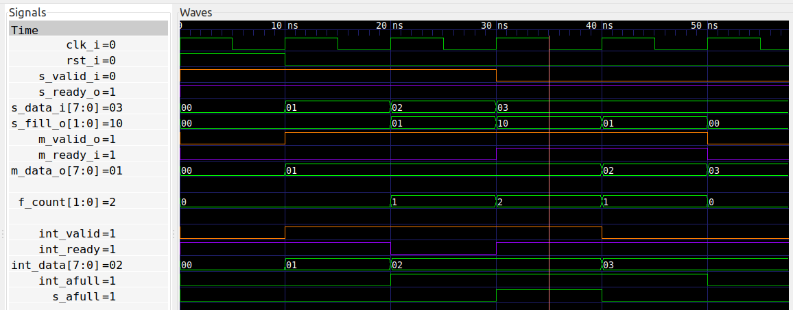

# Two Stage Buffer
The [One Stage Buffer](../one_stage_buffer) is convenient with its zero
latency, but sometimes additional buffering capacity is needed.  This is
exactly what the [Two Stage Buffer](two_stage_buffer.vhd) provides.

## Implementation
Instead of writing a state machine, I've chosen the hierarchical approch where
I instantiate two copies of the [One Stage Buffer](../one_stage_buffer) and
string them together. Since each of them have zero latency, the combination
will too, and therefore this approach works nicely. Some extra logic is needed
to calculate the total filling of the buffer.

## Formal verification
The formal verification is very similar to the [One Stage
Buffer](../one_stage_buffer/one_stage_buffer.psl).

## Running formal verification


## Synthesis
```
Number of cells:                 68
  BUFG                            1
  FDRE                           18
  IBUF                           12
  LUT2                            3
  LUT3                           22
  OBUF                           12

Estimated number of LCs:         22
```

Once again just 18 registers, but this time a total LUT count of 25.

