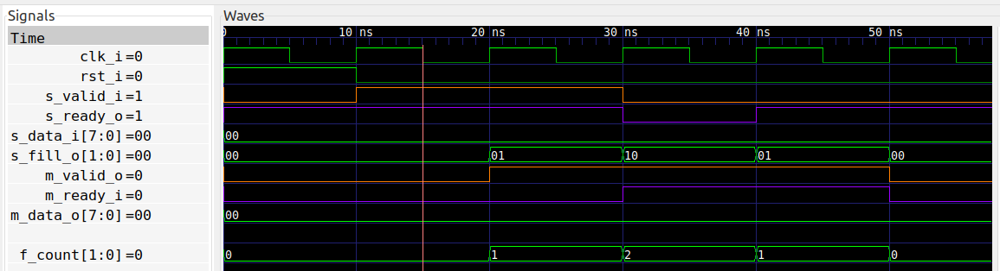

# Two Stage Fifo
The [One Stage FIFO](../one_stage_fifo) has a combinatorial path on the
upstream READY signal. This can be a problem in large designs, where such long
combinatorial paths lead to timing problems. To get a register on the READY
signal it is necessary to use a [Two Stage FIFO](two_stage_fifo.vhd).

The interface to the module is the same as for the [One Stage
FIFO](../one_stage_fifo), except that I've added an extra signal `s_fill_o`.
This provides information (to the producer) about the current filling level of
the FIFO. I.e. it is a value from zero to two. There may be situations where
the producer needs to know the current filling in order to predict whether the
FIFO can accept two or more consecutive cycles of data.

## The implementation
Not surprisingly, the implementation has exactly two sets of data registers,
and additionally two registers for the output control signals.

I've chosen not to have a separate register for the current filling level, so
instead that is calculated combinatorially from the control signals.

## Formal verification
The formal verification is very similar to that of the [One Stage
FIFO](../one_stage_fifo).  The main change is that the calculated FIFO size is
now verified to match the output signal `s_fill_o`.

The cover statement I've now chosen to show the FIFO filling transition from
2->1->0.

## Running formal verification
The result of running formal verification (by typing `make') is shown in this waveform:


## Synthesis
Running `make synth` shows the following resource utilization:
```
Number of cells:                 55
  BUFG                            1
  FDRE                           17
  FDSE                            1
  IBUF                           12
  LUT2                            2
  LUT3                            2
  LUT6                            8
  OBUF                           12

Estimated number of LCs:         10
```

As expected, we see a total of 18 registers. The total LUT count is 12.

